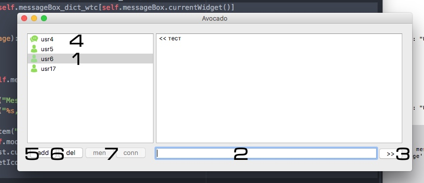

# messenger
This is the homework on the platform: geekbrains.ru

GUI Client:

1 - Выбор контакта из контакт листа, поле присланных/полученных сообщений соответственно меняется.
2 - Поле для ввода сообщения и логина юзера при добавлении контакта.
3 - Кнопка для отправки сообщения, так же отправляет Enter в поле 2.
4 - При получении входящего сообщения иконка в контакт листе изменяется (пока не будет прочтен).
5 - Добавление контакта в контакт лист, предварительно набрать логин в поле 2.
6 - Удаление контакта, предварительно выбрать в контакт листе.
